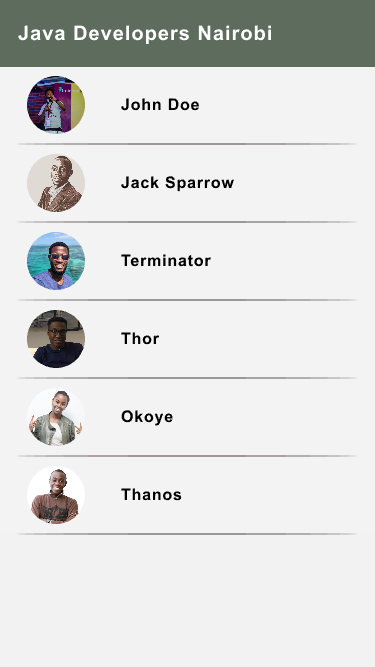

# Java Coders Nairobi

This is an Android app which shows the user profiles of all Java programmers on Github from Nairobi.
It displays a profiles list on the home page where a user can tap on a single profile to have a more detailed
view of it. A user can also share a single profile by tapping on a share button.
## UI Design
The UI consists of three main screens:
### A list of profile pictures and names for the respective users

### A single profile with a share button

### A single profile with share options

